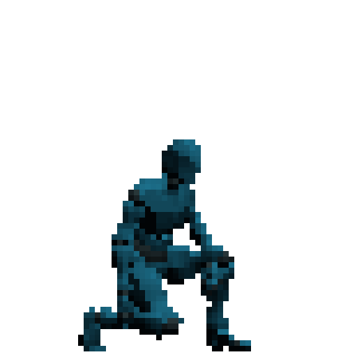

# Read me

This is a Unity project for exporting a camera's view as png images. 
Effectively it uses Unity to render out several images. This means that you can use Unity's lighting, shaders, post-proccessing, and tools to animate a scene.   
  
Here are some examples:  
 ## Fire:  
  
 This was done using a simple particle effect and some post processing.  
 
 ## Character:  
  
 This was achieved with a model and rig as well as some simple materials.  

## Versatility
The output resolution, frame rate, output length can all be controlled within the main script. 
